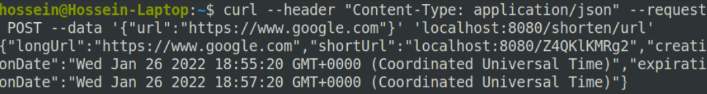
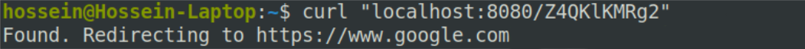

# Cloud Computing Project

A simple and scalable URL Shortener service developed with Node.js and MongoDB.

For deployment of the service, we used Docker and K8s (minikube).\
We used K8s Auto Scaling mechanism to determine the number of running pods.

## How to Run
0. Setup minikube.
1. Run `create_vol.sh`to create a persistant volume for the database.
2. Run `start.sh` to start the service.
3. Run `kubectl port-forward service/short-service 8080` to map cluster's internal IP to localhost:8080.
4. Now you can send requests to the server like below:

  
  

